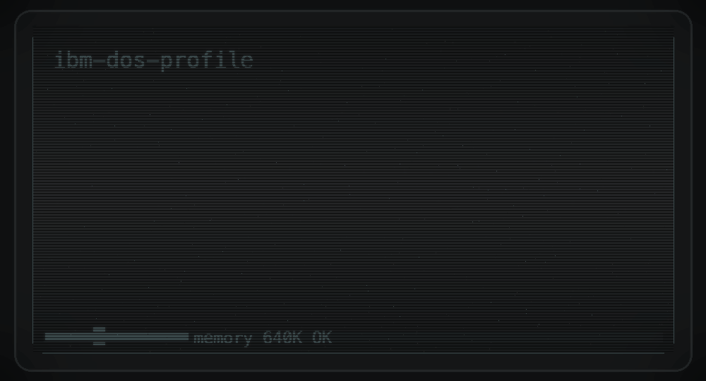

  

## About Me

EEE Student at the University of Bristol, focused on building practical software and engineering systems.

## Current Focus

- Learning deeply: `Python`, `C++`, `VHDL`
- Building project-based portfolios in software + engineering
- Exploring the intersection of AI and engineering workflows

## Featured Projects

- [Lumetric-Viz](https://github.com/rickkwang/Lumetric-Viz): Interactive visualization project.  
  Live demo: https://lumetric-pi.vercel.app
- [rickkwang.github.io](https://github.com/rickkwang/rickkwang.github.io): Personal website and portfolio source code.
- [Lazyvim_Setup](https://github.com/rickkwang/Lazyvim_Setup): Personal Neovim/LazyVim configuration and tooling setup.

## Tech Stack

  
  
  
  
  
  

## GitHub Stats

  
  

## Contact

- GitHub: https://github.com/rickkwang
- Website: https://rickkwang.github.io

If you like my work, please [Sponsor me ❤️](https://github.com/sponsors/rickkwang); it would be a great help to me.
